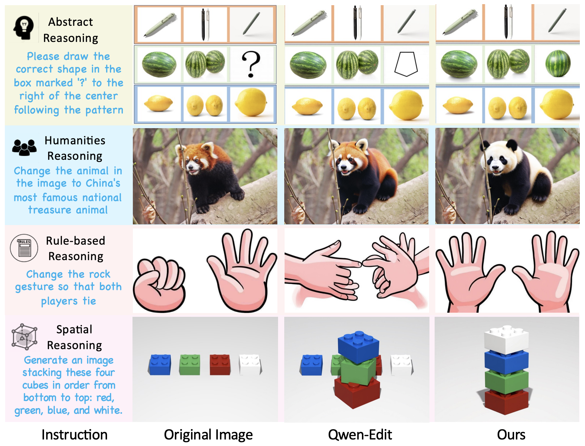

<p align="center">
  <h2 align="center"><i>ThinkRL-Edit</i>: Thinking in Reinforcement Learning for Reasoning-Centric Image Editing</h1>
  <!-- <h3 align="center">ICCV 2025</h3> -->
  <p align="center">
                <span class="author-block">
                <a href="https://echopluto.github.io/HomePage/" target="_blank">Hengjia Li</a>,
              </span>
              <span class="author-block">
                <a href="https://liming-jiang.com/" target="_blank">Liming Jiang</a><sup>✝</sup>,
              </span>
              <span class="author-block">
                <a href="https://scholar.google.com/citations?user=IUj5R3EAAAAJ&hl=en" target="_blank">Yizhi Song</a>,
              </span>
              <span class="author-block">
                <a href="https://scholar.google.com/citations?user=0TIYjPAAAAAJ&hl=en" target="_blank">Qing Yan</a>,
              </span>
              <span class="author-block">
                <a href="https://scholar.google.com/citations?user=VeTCSyEAAAAJ" target="_blank">Hao Kang</a>,
              </span>
              <span class="author-block">
                <a href="https://scholar.google.com/citations?user=-H18WY8AAAAJ&hl=en" target="_blank">Zichuan Liu</a>,
              </span><br>
              <span class="author-block">
                <a href="https://scholar.google.com/citations?user=mFC0wp8AAAAJ&hl=en" target="_blank">Xin Lu</a>,
              </span>
              <span class="author-block">
                <a href="https://scholar.google.com/citations?user=AqDe35sAAAAJ&hl=zh-CN" target="_blank">Boxi Wu</a>sup>§</sup>,
              </span>
              <span class="author-block">
                <a href="https://xingangpan.github.io/" target="_blank">Deng Cai</a><
  </p>

  <p align="center">
    <sep>✝</sep>Project Lead &nbsp;
    <sep>§</sep>Corresponding Author
  </p>

  <p align="center">
    <a href="https://arxiv.org/abs/2601.03467"></a>
    <a href="https://echopluto.github.io/ThinkRL-page/"></a>
  <a href="https://huggingface.co/Pluto5/ThinkRL"></a>
    <!-- <a href="https://twitter.com/sze68zkw"></a> -->
  </p>

  <div align="center">
    
    <p align="left">Although unified multimodal generative models such as Qwen-Edit have substantially improved editing quality, their underlying reasoning remains underexplored, especially for reasoning-centric editing. In contrast, our method delivers accurate edits with deep reasoning, achieving strong consistency and high perceptual quality across diverse reasoning-driven editing scenarios. <b>See our <a href="https://echopluto.github.io/ThinkRL-page/">🌐 Project Page</a> for more details and results.</b>
</p>
    
  </div>
</p>


## 🚀 Getting Started
### Installation
```bash
git clone https://github.com/EchoPluto/ThinkRL-Edit.git
cd ThinkRL
conda create -n thinkrl python=3.10.16
pip install -e .
```
<!-- If the installation of `flash_attn` fails, try installing the other packages first and install `flash_attn` at last. -->
<!-- To run the code with CUDA properly, you can comment out `torch` and `torchvision` in `requirement.txt`, and install the appropriate version of `torch>=2.1.0+cu121` and `torchvision>=0.16.0+cu121` according to the instructions on [PyTorch](https://pytorch.org/get-started/locally/). -->

### Model Download
Download our model from Huggingface:
| Models | Download Links | Description |
|---------------|---------------|---------------|
| Editing Model    | 🤗 [Huggingface](https://huggingface.co/Pluto5/ThinkRL)    | Reasoning-Centric Editing model |

### Run the Code
You can run an example using the following command:
```bash
torchrun --nproc_per_node 8 --master_port 60001 infer_qwen.py
```

## ❤️ Ackowledgement
Our implementation is based on [Flow-GRPO](https://github.com/yifan123/flow_grpo/tree/main). Thanks for the great open-source work!

## 📌 Citation
If any part of our paper or code is helpful to your research, please consider citing our work 📝 and give us a star ⭐. Thanks for your support!
```bibtex
@article{li2026thinkrl,
  title={ThinkRL-Edit: Thinking in Reinforcement Learning for Reasoning-Centric Image Editing},
  author={Li, Hengjia and Jiang, Liming and Yan, Qing and Song, Yizhi and Kang, Hao and Liu, Zichuan and Lu, Xin and Wu, Boxi and Cai, Deng},
  journal={arXiv preprint arXiv:2601.03467},
  year={2026}
}
```